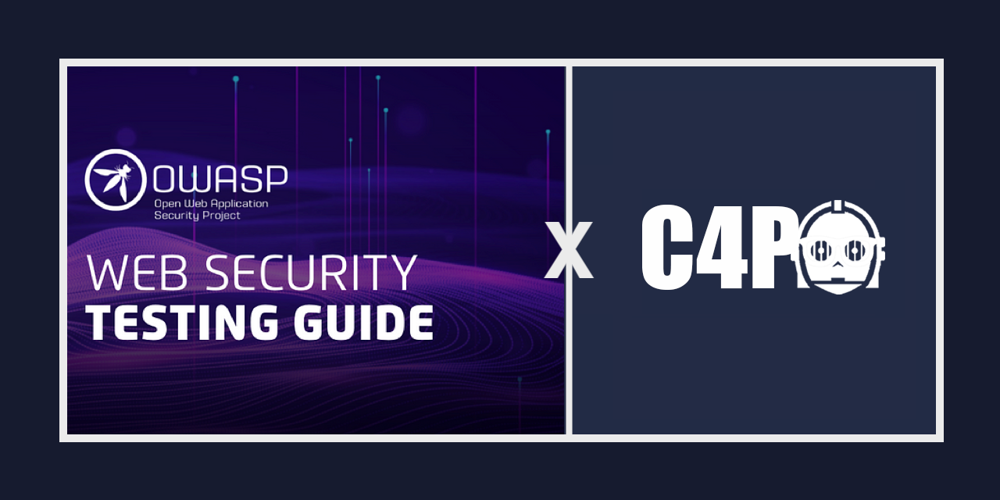

---

layout: col-sidebar
title: OWASP Security-C4PO
tags: c4po-main
level: 1
type: code
pitch: Simplify Pentest Planning, Reporting, and Findings Delivery with C4PO

---

<!-- @IGNORE PREVIOUS: link -->

## Description

Welcome to the frontend repository of Security C4PO, an open-source pentest reporting tool.
Security C4PO is a powerful, user-friendly tool designed to simplify the process of generating professional pentest reports.
It aims to streamline and automate the often time-consuming task of creating comprehensive reports by providing an intuitive web-based interface that facilitates the content of the [OWASP TESTING GUIDE](https://owasp.org/www-project-web-security-testing-guide/v42/).

This repository contains the codebase of Security C4PO, built with an Angular Frontend and two Spring Boot Backend Microservices.

## Licensing

Security C4PO is licensed under the [Apache License 2.0](https://www.apache.org/licenses/LICENSE-2.0) License. Please see the [LICENSE](https://github.com/marcel-haag/security-c4po/blob/main/LICENSE.md) file for more information.

We hope you find Security C4PO useful for managing and generating pentest reports. If you encounter any issues or have suggestions for improvement, please feel free to create an issue on the [issue tracker](https://github.com/Marcel-Haag/security-c4po/issues).
