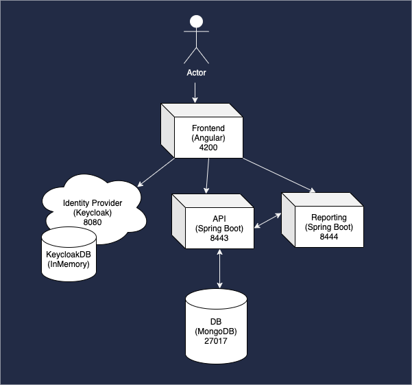
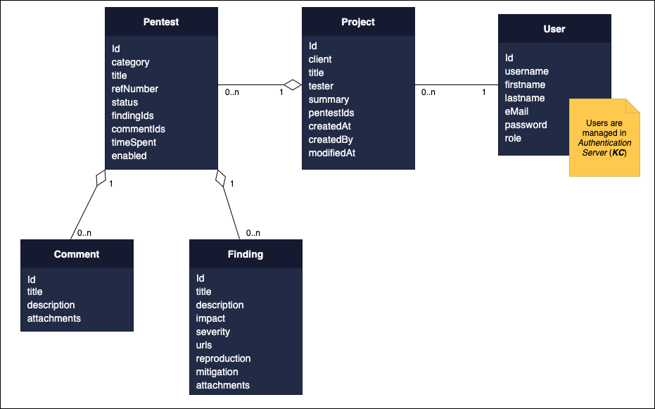

## Techstack

### Development server
Execute `c4po-dev.sh` and all services will run on a dev server.
You can reach the application by entering http://localhost:4200 in you browser.

### Testuser Credentials
* Username: c4po
* Password: Test1234!

## Application Architecture

## Data Structure

